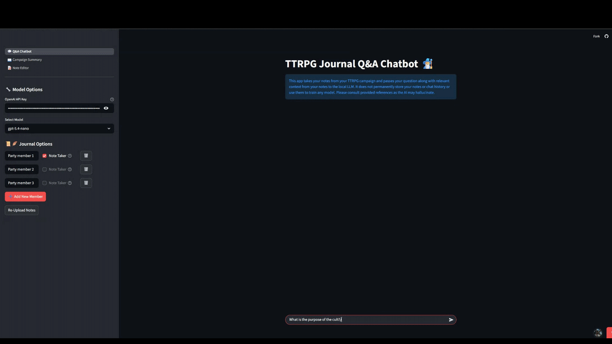

# TTRPG Campaign Assistant

A campaign Q&A chatbot for tabletop RPG players. Upload your dated campaign notes, ask questions in plain language, generate a campaign summary, and keep notes — all grounded in your own journal via Retrieval-Augmented Generation (RAG).



[](https://ttrpgchatbot.streamlit.app/)

**[Demo Video](https://drive.google.com/file/d/1I0d2QcdKzuUCRJrmx3qVgO65fLcu1dzd/view?usp=sharing)**

The assistant chunks and vectorizes your campaign notes, then passes your question along with the most relevant note excerpts to a local LLM (served by [Ollama](https://ollama.com/)) so answers stay grounded in what actually happened at your table. Every answer links back to the source note entries so you can check the LLM's work. Everything — embeddings, vector store, and chat model — runs locally; nothing is uploaded to a third-party API, and no API key is required.

---

## Community Cloud Demo

**▶️ Try it now: [ttrpgchatbot.streamlit.app](https://ttrpgchatbot.streamlit.app/)** — no install required. Bring your own OpenAI API key.

This branch is the local-first version of the app, built around Ollama and FastEmbed. The hosted demo runs a separate build (the `streamlit` branch) on Streamlit Community Cloud, swapping the local pieces for hosted equivalents so it works in a browser with nothing installed:

- **[Streamlit Community Cloud](https://streamlit.io/cloud)** — hosting
- **[OpenAI](https://platform.openai.com/)** — chat models (`gpt-5.4-nano`/`-mini`/`-full`) and `text-embedding-3-small` embeddings, billed to your own API key
- **[LangChain](https://www.langchain.com/)** — RAG pipeline orchestration
- **[Chroma](https://www.trychroma.com/)** — vector store
- **[pytest](https://docs.pytest.org/)** — test suite

Your key is used only for your current browser session and is never written to disk; all chat and embedding calls are billed to your own OpenAI account.

---

## Features

### 💬 Q&A Chatbot
- Ask questions about your campaign in natural language and get answers grounded **only** in your uploaded notes.
- Each answer ends with **reference buttons labeled by note date** — click one to open the exact note excerpt the answer drew from.
- Configure your party in **Journal Options**: add/remove party members and mark which one is the **note taker**, so the model knows whose perspective the notes are written from.
- When no relevant notes are found, the app skips the LLM and returns a clear "no relevant entries" message instead of guessing.
- Custom magical loading animations for a bit of table flavor. ✨

### 📖 Campaign Summary
- Generate a full campaign summary from your uploaded notes using a hierarchical map-reduce summarization pass, so even a long journal condenses into a readable recap.

### 📝 Note Editor
- Write and edit campaign notes in a rich-text editor directly in the app, with dark mode and TXT/DOCX export.

### How it works (RAG pipeline)
1. **Ingest** — your `.txt` / `.docx` / `.csv` journal is parsed into dated entries.
2. **Chunk** — entries are split into semantically coherent chunks for better retrieval.
3. **Embed** — chunks are embedded locally with FastEmbed's `BAAI/bge-base-en-v1.5` model (no GPU or PyTorch required).
4. **Store** — embeddings are persisted in a local Chroma vector store.
5. **Retrieve & answer** — at query time, the most semantically similar chunks are fetched and passed as context to your chosen local Ollama model, which answers using only that context.

---

## Running locally with Ollama

This app requires a local [Ollama](https://ollama.com/) installation to serve the chat model — there's no hosted version and no API key to manage.

### 1. Install Ollama and pull a model
Install Ollama from **[ollama.com](https://ollama.com/)**, then pull at least one model, for example:

```bash
ollama pull llama3.2
```

Any model installed in Ollama will show up as a selectable option in the app. Larger, more capable models will generally give better answers at the cost of speed and RAM.

> Ollama runs entirely on your machine — no campaign notes or chat history ever leave your computer.

### 2. Select a model and temperature
In the sidebar under **🔧 Model Options**, choose one of your locally installed Ollama models and set its temperature. This selection is remembered between sessions.

### 3. Set up your party
Under **📜🪶 Journal Options**, add each party member's name and check **Note Taker** for the character whose perspective the notes are written from. These names are woven into the prompt so answers refer to the party correctly.

### 4. Upload your campaign notes
Once a model is selected, upload your journal file (see **[Preparing your notes](#preparing-your-notes)** below). The app embeds it into the local vector store — you'll get a toast when it's done, and a campaign summary becomes available on the Campaign Summary page.

### 5. Ask, summarize, and take notes
Use the **Q&A Chatbot** page to ask questions, the **Campaign Summary** page to generate a recap, and the **Note Editor** page to jot down new notes.

---

## Preparing your notes

The quality of retrieval depends on how your notes are structured. **Date-delimited notes give the best results**, because each dated entry is stored with its date and answers can cite the entry by date.

### Supported file formats
- **`.txt`** — plain text with dates (recommended, simplest).
- **`.docx`** — Word documents; paragraphs are read in order and parsed the same way as `.txt`.
- **`.csv`** *(advanced)* — read directly into a table and must already contain `Title`, `Date`, and `Contents` columns. No date auto-detection is applied to CSVs.

### Date formats
For `.txt` and `.docx` files, a line is treated as the start of a **new dated entry** when it *begins* with a date in one of these formats:

| Format | Example |
| --- | --- |
| `YYYY-MM-DD` | `2023-10-27` |
| `M/D/YY` or `M/D/YYYY` | `10/27/2023` or `10/27/23` |

Everything after the date on that line, plus every following line, belongs to that entry until the next dated line. Any text **before the first date** is grouped under a single `Unknown Date` entry — so lead with a date to keep entries clean.

### Example note file

```
2023-10-27
We arrived in the port town of Saltmarsh at dusk. Thaddeus haggled with a
fishmonger while Bram scouted the docks. A hooded figure watched us from
the tavern window.

2023-11-03
The hooded figure turned out to be an agent of the Sahuagin. We tracked
her to an abandoned lighthouse north of town.

11/10/2023
Ambush at the lighthouse. Bram nearly drowned. We recovered a waterlogged
journal mentioning "the tide that does not turn."
```

Each dated block becomes a retrievable entry, and answers that draw on it will show a button labeled with its date.

---

## Setup

```bash
# 1. Clone
git clone https://github.com/Wyatt-J-Davis/DandDRagChatbot.git
cd DandDRagChatbot

# 2. Create and activate a virtual environment
python -m venv venv
venv\Scripts\activate        # Windows
# source venv/bin/activate   # macOS / Linux

# 3. Install dependencies
pip install -r requirements.txt

# 4. Install Ollama and pull at least one model (see above)

# 5. Run
python -m streamlit run streamlit_app.py
```

The app opens in your browser. Select an installed Ollama model in **Model Options** and you're off.

A standalone Windows executable can also be built with `scripts\build_exe.bat` (see `scripts/build/TTRPGChatbot.spec`).

---

## Built with

- **[Streamlit](https://streamlit.io/)** — UI
- **[LangChain](https://www.langchain.com/)** — RAG pipeline orchestration
- **[Chroma](https://www.trychroma.com/)** — local vector store
- **[FastEmbed](https://qdrant.github.io/fastembed/)** — local `BAAI/bge-base-en-v1.5` embeddings
- **[Ollama](https://ollama.com/)** — local LLM serving
- **[pytest](https://docs.pytest.org/)** — test suite

---

## Contributing

Contributions are welcome! To keep the app stable:

- **Run the tests and make sure they pass** before opening a PR:
  ```bash
  scripts\run_tests.bat
  ```
- **Add tests for any new feature or bug fix.** New behavior should come with new coverage.
- **Match the existing style.** The codebase is class-based — new functionality should live in an appropriate class (creating a new one, inheriting from a suitable base where it fits, rather than bolting logic onto unrelated code).

Then open a pull request describing your change.

---

## License

Released under the [MIT License](LICENSE).
